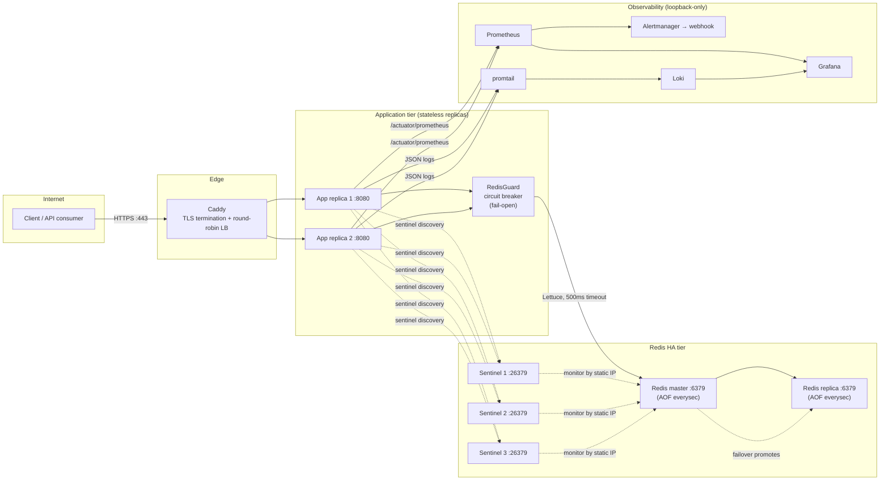
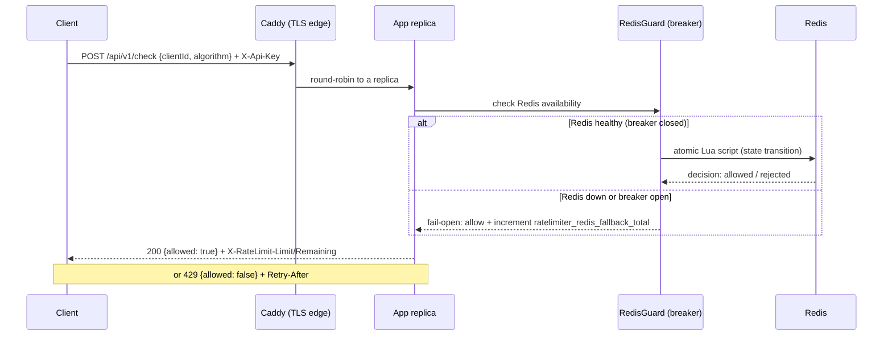
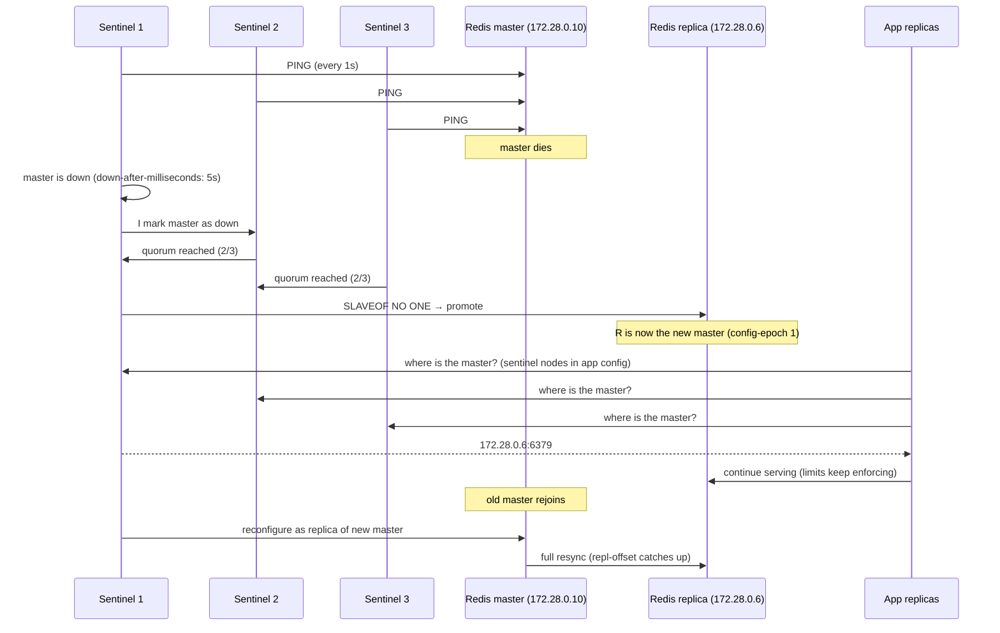
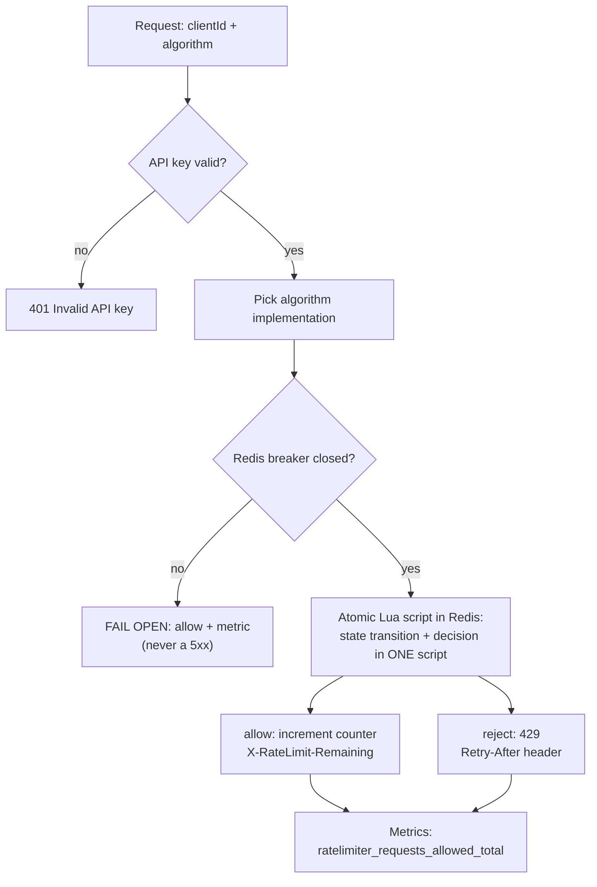
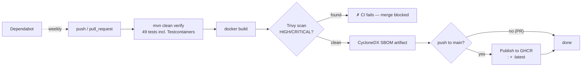

# Rate Limiter Service

**Distributed rate-limiting as a service (RLaaS)** — a Spring Boot microservice that decides, per client, whether a request is allowed or throttled (HTTP 429). Five classic algorithms, **Redis-backed shared state** (atomic Lua scripts — concurrency-safe), a Redis HA topology with Sentinel failover, a TLS edge, and full observability. Hardened for production and load-tested.

    

## At a glance

- **A rate limiter you deploy once, and point every API at** — `POST /api/v1/check` with a `clientId` and an algorithm choice; get `allowed: true/false` + standard rate-limit headers back.
- **Distributed by design**: all counters live in Redis, so N replicas enforce the same limits — no per-instance state, no window leakage under scaling.
- **Survives Redis outages**: every Redis call sits behind a Resilience4j circuit breaker with a **fail-open** policy — the limiter degrades, it never 500s.
- **HA topology verified live**: Sentinel failover (master killed → replica promoted in ~15 s → limits keep enforcing, old master rejoins as replica), 3-sentinel quorum (quorum 2), AOF persistence + data volumes.
- **Production shape load-tested**: ~2,400 req/s through the TLS edge at **0.00% 5xx**, p95 44.9 ms (edge) / 13.5 ms (in-app).
- **CI/CD that actually gates**: tests → Docker build → Trivy vulnerability scan → CycloneDX SBOM → GHCR publish. It blocked CVE-2026-59901 during development.

---

## Architecture



**Reading the diagram**: clients hit only the Caddy edge. Replicas are stateless — every limit decision is an atomic Redis transaction. Sentinel nodes watch the master by static IP and elect a replacement when it dies. Prometheus scrapes each replica individually (DNS service discovery), promtail ships each container's logs to Loki, and Grafana visualizes both. All monitoring ports bind to loopback only.

## Request flow



## Redis Sentinel failover



**Live-verified drill** (see [`RUNBOOK.md`](RUNBOOK.md)): killed one sentinel, then the master — failover still completed with 2/3 sentinels, the app served requests throughout, and the old master rejoined as a replica on restart.

## Rate limiter algorithm flow



Every algorithm's state transition — read, mutate, expire — runs inside **one Lua script**, so concurrent requests from any number of replicas can never race.

## CI/CD pipeline



The scan gate is real: during development it caught **CVE-2026-59901** (netty-codec bzip2) and Alpine base-image CVEs — fixed by a netty pin + `apk upgrade` in the Dockerfile. Today the image scans at 0 HIGH/CRITICAL.

---

## Features

- **Five production algorithms** with exact semantics — see [Algorithms](#algorithms).
- **Atomic distributed state** in Redis Lua scripts (no `INCR`-without-`EXPIRE` races).
- **Fail-open circuit breaker** (Resilience4j) + 500 ms Redis command timeout — the limiter never 500s the API.
- **HA Redis topology**: master + replica + **3-sentinel quorum (quorum 2)**, automatic failover, AOF persistence (everysec) + named data volumes on both nodes — state survives restarts *and* failover.
- **Horizontal scaling**: stateless replicas, Caddy round-robin LB, Prometheus DNS discovery per replica, per-replica log labels in Loki — all verified live.
- **Optional API-key auth** (`X-Api-Key`) with fail-closed Docker config (compose refuses to start without a key).
- **TLS everywhere**: edge TLS via Caddy (auto Let's Encrypt) or embedded-keystore profiles (`dev`/`prod`); optional TLS to Redis (`REDIS_SSL=true`).
- **Full observability**: Prometheus metrics + 6 alert rules, Alertmanager routing with inhibit rules, Loki + promtail JSON structured logs, auto-provisioned Grafana dashboard.
- **Security-gated CI**: tests → build → Trivy scan → CycloneDX SBOM → GHCR publish; Dependabot weekly.
- **Operations runbook**: [`RUNBOOK.md`](RUNBOOK.md) — per-alert procedures, failover drill, backup/restore, scaling, upgrades.
- **Swagger UI** at `/swagger-ui.html`.

## Algorithms

All state transitions are atomic Redis Lua scripts.

| Algorithm | Exact? | Semantics |
|---|---|---|
| `FIXED` | yes | Per-client counter, atomic `INCR`+`EXPIRE`; resets at each window boundary. |
| `SLIDING_LOG` | yes | Redis sorted set of request timestamps; expired entries trimmed, window count checked, request appended — all in one script. |
| `SLIDING_COUNTER` | approximate | Weights the previous window's counter by elapsed time: `estimated = prevCount × (1 − elapsed/window) + currentCount`. |
| `TOKEN_BUCKET` | yes | Bucket holds up to `limit` tokens, refills by full capacity per window (lazy refill on access); a request consumes one token. |
| `LEAKY_BUCKET` | yes | **Water-level model (not a queue):** water leaks at one unit per window; a request is allowed only while `water < capacity`. Rejection is immediate when full — no waiting queue. |

## Technology stack

| Layer | Choice |
|---|---|
| Language / framework | Java 21, Spring Boot 3.5 (supported line; Boot 4 migration deferred) |
| Redis client | Spring Data Redis / Lettuce, atomic Lua scripts |
| Resilience | Resilience4j 2.4 circuit breaker (RedisGuard) |
| Metrics | Micrometer + Prometheus (`/actuator/prometheus`) |
| Data store | Redis 7 (master + replica + 3 Sentinels, AOF everysec) |
| Edge / TLS | Caddy 2 (auto HTTPS, round-robin LB) |
| Observability | Prometheus, Alertmanager, Grafana (auto-provisioned dashboard), Loki + promtail |
| Logging | Logback structured JSON with `X-Request-Id` correlation |
| Testing | JUnit 5, Testcontainers (49 tests incl. Redis-down fail-open + concurrency tests) |
| CI/CD | GitHub Actions, Trivy (0.73.0), CycloneDX SBOM, GHCR |

## High-level design decisions

1. **Redis is the single source of truth** — replicas are stateless, so scaling is just `--scale app=N`. All limit transitions are atomic Lua scripts, safe under any concurrency.
2. **Fail-open, not fail-closed** — when Redis is down the limiter lets traffic through and *alerts* instead of 500-ing everything. Availability over strictness; documented trade-off, and the outage is visible via `ratelimiter_redis_fallback_total` + the breaker state. Fail-closed is a one-line change if your policy differs.
3. **Sentinels monitor the master by static IP** — hostname monitoring breaks failover because a stopped container's DNS name disappears. This applies to real infra too: monitor by IP or a stable VIP, never a name that goes away with the node.
4. **TLS at the edge, not in the app** — Caddy terminates HTTPS; the app stays plain HTTP on the internal network and publishes no host port in TLS mode (edge-only exposure).
5. **Fail-closed configuration** — `RATELIMITER_API_KEY` and `GRAFANA_ADMIN_USER/PASSWORD` are *required* by compose; a fresh clone can never silently run unauthenticated or with `admin/admin`.
6. **Security gates in CI, not after** — Trivy blocks HIGH/CRITICAL merges; the SBOM is generated from the *image* (an `fs` SBOM hit Maven Central rate limits) and uploaded as an artifact.
7. **Observability is loopback-only** — Prometheus/Alertmanager/Loki/Grafana bind to `127.0.0.1`; Grafana requires real credentials; Alertmanager routes criticals immediately (10 s group_wait, 1 h repeat) with an inhibit rule so `RedisFailingOpen` is silenced while `RedisCircuitBreakerOpen` is active.

## API

Interactive docs (with a "Try it out" button): [`/swagger-ui.html`](https://localhost/swagger-ui.html). Raw spec: `/v3/api-docs`. All examples below are copied from the live service.

### Authentication

When `RATELIMITER_API_KEY` is set, every request to `/api/v1/**` **and** to the Swagger/OpenAPI endpoints (`/swagger-ui.html`, `/swagger-ui/**`, `/v3/api-docs/**`) must carry it in the `X-Api-Key` header (header names are case-insensitive). With no key configured the API and the docs are open. Swagger UI offers "Authorize" for the `X-Api-Key` scheme.

```bash
curl https://api.example.com/api/v1/check \
  -H "Content-Type: application/json" \
  -H "X-Api-Key: your-api-key"
```

### Request body

`clientId` is required; `algorithm` is one of `FIXED`, `SLIDING_LOG`, `SLIDING_COUNTER`, `TOKEN_BUCKET`, `LEAKY_BUCKET` (case-insensitive).

```json
{ "clientId": "user123", "algorithm": "FIXED" }
```

### Response body

**200 – allowed**
```json
{ "allowed": true, "message": "Request allowed" }
```

**429 – rejected**
```json
{ "allowed": false, "message": "Rate limit exceeded for client user123" }
```

### Error responses

| Code | Meaning | Body |
|---|---|---|
| `400` | Missing/invalid `clientId` or `algorithm`, unknown algorithm, or malformed JSON | `{"message":"clientId: must not be blank"}` / `{"message":"Malformed request body"}` |
| `401` | Missing/wrong `X-Api-Key` (when a key is configured) | `{"error":"Invalid API key"}` |
| `500` | Unexpected error | `{"message":"Internal server error"}` |

### Rate-limit behavior

Both 200 and 429 carry rate-limit headers, so clients can self-throttle without parsing bodies:

- `X-RateLimit-Limit` — configured limit for the algorithm
- `X-RateLimit-Remaining` — remaining in the current window (200 only; estimated for `SLIDING_COUNTER`, drained water for `LEAKY_BUCKET`)
- `Retry-After` — seconds until window reset (429 only)
- `X-Request-Id` — per-request correlation id (also in the logs)

Example conversation (limit 100/60 s):

```text
→ POST /api/v1/check  {"clientId":"user123","algorithm":"FIXED"}
← 200 {"allowed":true,"message":"Request allowed"}
  X-RateLimit-Limit: 100   X-RateLimit-Remaining: 99   X-Request-Id: 8f3c…
   …98 more allowed requests…
← 429 {"allowed":false,"message":"Rate limit exceeded for client user123"}
  X-RateLimit-Limit: 100   Retry-After: 37   X-Request-Id: b1e9…
```

State is shared across replicas (Redis), so the same limits hold no matter which replica answers.

Other endpoints: `/actuator/health` and `/actuator/prometheus` are public; `/v3/api-docs` and `/swagger-ui.html` require the `X-Api-Key` header when one is configured.

## Configuration

Base config in `src/main/resources/application.yml`:

```yaml
spring:
  data:
    redis:
      host: localhost
      port: 6379
      password: ${REDIS_PASSWORD:}   # optional Redis AUTH
      timeout: 500ms                  # bound on every Redis command
      ssl:
        enabled: ${REDIS_SSL:false}   # optional TLS to Redis

ratelimiter:
  apiKey: ''            # optional; see Authentication
  limits:
    default: 100        # per-algorithm overrides possible, e.g. TOKEN_BUCKET: 50
  windows:
    default: 60s        # per-algorithm overrides, e.g. SLIDING_LOG: PT2M
```

> **Gotcha:** durations must use ISO-8601/Spring units (`60s`, `PT1M`, `2h`). A bare number (`60`) is interpreted as **milliseconds**.

| Env var | Meaning |
|---|---|
| `SPRING_DATA_REDIS_HOST`, `SPRING_DATA_REDIS_PORT` | Redis connection (default `localhost:6379`) |
| `REDIS_PASSWORD` | Redis AUTH password; blank = no auth |
| `REDIS_SSL` | `true` = TLS to Redis |
| `RATELIMITER_API_KEY` | API key required on `/api/v1/**`; blank = open |
| `RATELIMITER_DEFAULT_LIMIT` | Default per-client limit (prod default 200) |
| `RATELIMITER_DEFAULT_WINDOW_SEC` | Default window seconds (prod default 30) |
| `KEYSTORE_PASSWORD` | Keystore password for the `prod` profile |
| `RECEIVER_URL` | Alertmanager webhook receiver (rendered at container start) |
| `GRAFANA_ADMIN_USER`, `GRAFANA_ADMIN_PASSWORD` | Grafana credentials — **required**, no default |

## Docker Compose

Compose files are **additive profiles** — always pass the full set so every container is reconciled:

| Profile | Files | What you get |
|---|---|---|
| Base | `docker-compose.yml` | App + standalone Redis (healthchecks, optional AUTH) |
| HA | `+ docker-compose.redis-ha.yml` | Master + replica + Sentinel, failover |
| Quorum | `+ docker-compose.sentinel-ha.yml` | 3 sentinels, quorum 2 (production) |
| Observability | `+ docker-compose.monitoring.yml` | Prometheus, Alertmanager, Loki, promtail, Grafana |
| TLS edge | `+ docker-compose.tls.yml` | Caddy HTTPS edge (app publishes no host port) |

```bash
cp .env.example .env          # set RATELIMITER_API_KEY (+ REDIS_PASSWORD, Grafana creds, RECEIVER_URL)

# Production shape (full set):
docker compose -f docker-compose.yml -f docker-compose.redis-ha.yml \
  -f docker-compose.sentinel-ha.yml -f docker-compose.monitoring.yml \
  -f docker-compose.tls.yml up -d --scale app=2
# → https://localhost (or https://<TLS_DOMAIN>)

# Dev (no edge, app exposed on 8080):
docker compose -f docker-compose.yml -f docker-compose.redis-ha.yml -f docker-compose.monitoring.yml up -d --build
```

For a real domain: set `TLS_DOMAIN` in `.env` and remove `tls internal` from `caddy/Caddyfile` — Caddy then obtains and renews Let's Encrypt certificates automatically.

## Monitoring & Alerting

```bash
# Prometheus:   http://localhost:9090 (alerts /alerts, targets /targets)
# Alertmanager: http://localhost:9093
# Grafana:      http://localhost:3000 (auto-provisioned "Rate Limiter" dashboard)
# Loki API:     http://localhost:3100
```

All monitoring ports bind to **127.0.0.1 only**. Auto-provisioned dashboards: "Rate Limiter" (request rate per algorithm, throttled rate, throttle ratio, fail-open rate, breaker state, p95/p99 latency, 5xx rate) and "SLO Error Budget" (5m and 30d error ratio, burn rate, last Redis backup age, request/5xx volume). Backups run automatically every 24h via the `redis-backup` sidecar (BGSAVE + tar, `BACKUP_KEEP` archives in `./backups`), publishing a freshness metric so failures page as `RedisBackupStale`.

Ten alert rules (validated on the live deployment):

| Alert | Condition | Severity |
|---|---|---|
| `RateLimiterDown` | `up == 0` for 1m | critical |
| `RedisCircuitBreakerOpen` | breaker `redis` open for 1m | critical |
| `RedisFailingOpen` | `ratelimiter_redis_fallback_total` increasing | warning |
| `RedisBackupStale` | no successful backup in 36h (or metric absent) | critical |
| `HighThrottleRate` | >50% of requests are 429 for 5m | warning |
| `HighApiKeyFailures` | sustained bad API keys (credential stuffing) | warning |
| `HighLatencyP99` | p99 `http_server_requests_seconds` > 1s for 5m | warning |
| `SloErrorBudgetBurnFast` | >14.4x burn rate for 15m (99.9% budget ~2 days) | critical |
| `SloErrorBudgetBurnSlow` | >6x burn rate for 1h (99.9% budget ~5 days) | warning |
| `SloErrorBudgetExhausted` | 30-day error ratio > 0.1% | critical |

Alerts are routed by Alertmanager to the `RECEIVER_URL` webhook (set it in `.env`; see the placeholder in `.env.example`).

Logs are structured JSON shipped by promtail to Loki, labeled `container` / `service` / `container_id` — query `{container="rate-app-1"}` in Grafana Explore. Full operational procedures live in [`RUNBOOK.md`](RUNBOOK.md).

## SLOs (defaults)

| SLO | Definition | Backing alert |
|---|---|---|
| Availability | 99.9% of `/api/v1/check` calls succeed (non-5xx) | `RateLimiterDown`, `RedisCircuitBreakerOpen`, `SloErrorBudgetBurnFast` / `BurnSlow` / `Exhausted` |
| Latency | p95 < 50 ms, p99 < 1 s | `HighLatencyP99` |
| Correctness | no 5xx due to limiter failure; fail-open only during Redis outages | `RedisFailingOpen` |
| Error budget | 429s count toward the availability budget; track rejected/total | `HighThrottleRate` |
| Data safety | daily Redis backups exist and are fresh | `RedisBackupStale` |

## Load testing

- **JUnit soak** (excluded from the default run): `mvn test -Dtest=SoakTest "-Dexcluded.test.groups="`
- **k6** (production-scale runs): `k6 run --env API_KEY=... --vus 100 --duration 2m loadtest/check.js` — fails if 5xx ≥ 0.1%, p95 ≥ 100 ms (edge), or checks fail. 429s are expected (the limiter working) and reported separately as `http_429`.

**Measured on the production shape** (TLS edge → 2 replicas → 3-sentinel Redis HA, 100 VUs ramping, 2 min):

| Metric | Result |
|---|---|
| Throughput | ~2,400 req/s (290k requests in 2 min) |
| Server errors (5xx) | **0.00%** (k6 and Prometheus agree) |
| p95 latency | 44.9 ms at the edge (k6), 13.5 ms in-app (Prometheus) |
| Throttle ratio | 95.2% (deliberate — per-client windows far below load; k6 and Prometheus agree) |
| Replica balance | ~50/50 across both app instances (Prometheus per-instance rates) |
| Redis fail-open | 0 (`ratelimiter_redis_fallback_total` stayed 0 for the whole run) |

## Metrics

`ratelimiter_requests_total` / `_allowed` / `_rejected` (per instance), `ratelimiter_algorithm_calls_total{algorithm="…"}`, `ratelimiter_auth_invalid_api_key_total`, `ratelimiter_redis_fallback_total` (**alert on this**), `resilience4j_circuitbreaker_*` for the `redis` breaker, plus standard `http_server_requests_seconds` histograms (percentiles enabled).

## Testing

```bash
mvn test        # 49 tests; Testcontainers requires Docker
mvn verify      # full build with tests + JaCoCo coverage report (target/site/jacoco/)
```

**Coverage: 91.3% lines / 92.2% instructions / 69.4% branches** (JaCoCo, `mvn verify`).

| Layer | Tests |
|---|---|
| Algorithms (all 5) | unit + Testcontainers integration: within limit, beyond limit, window expiry, `remaining()` |
| Concurrency (all 5) | parallel requests never race (atomic Lua scripts) |
| Redis outage | fail-open: requests allowed + full limit reported while Redis is down (FIXED + SLIDING_COUNTER) |
| Circuit breaker | success pass-through, failure → fail-open, open circuit short-circuits (Redis not invoked), half-open recovery |
| Security | `ApiKeyAuthFilter` unit tests (valid/missing/wrong key, open access, non-API paths) + e2e 401 through the real filter chain |
| REST e2e | real Redis + real security chain: 200 + rate-limit headers, 429 + Retry-After, 400 (validation, unknown algorithm, malformed JSON), 401, client isolation |

## CI/CD & release

`.github/workflows/ci.yml` on every push/PR: JDK 21 + Maven (cached) → `mvn clean verify` → `docker build` → **Trivy scan** (fails on unfixed HIGH/CRITICAL) → **CycloneDX SBOM** artifact → on `main`, **publish to GHCR** (`ghcr.io/1046prt/rate-limiter-service:<sha>` + `:latest`). Dependabot opens weekly update PRs; each is CI-gated, so security-breaking updates can't merge silently.

## Logging

Logback writes **structured JSON** with MDC context incl. `X-Request-Id` — ship to any JSON log collector as-is.

## Future improvements

- **Multi-host DR** — a true cross-host Sentinel quorum and replica placement (the current HA is single-host; a host loss is still a total outage).
- **Kubernetes/Helm deployment** — Deployment/StatefulSet manifests, HPA on the throttle metric, service mesh edge.
- **Dynamic limit administration** — an admin API/CRUD for limits (no redeploy), quota tiers, burst credits.
- **Higher-performance callers** — gRPC or binary protocol for very high QPS.
- **Redis Cluster / partitioning** for multi-region or huge client bases.
- **OpenTelemetry tracing** across edge → limiter → Redis.
- **Fail-closed mode** as a config option for stricter deployments.
- **Boot 4 migration** — nothing in the codebase depends on Boot-3-specific internals.

## Repository layout

```
├── src/main/java/.../ratelimiter/     # controllers, algorithms, config, resilience
│   ├── algorithm/                     # 5 limiter implementations (Lua scripts)
│   ├── config/                        # Redis, metrics, security config
│   └── resilience/                    # RedisGuard circuit breaker + fail-open
├── src/test/java/.../                 # 49 tests incl. concurrency + Redis-down
├── monitoring/                        # Prometheus, Alertmanager, Loki, Grafana, promtail configs
├── caddy/                             # Caddyfile (TLS edge + LB)
├── loadtest/                          # k6 scenario
├── docker-compose*.yml                # additive profiles (base/HA/quorum/monitoring/TLS)
├── RUNBOOK.md                         # on-call procedures, drills, backup/restore
├── docs/architecture.md               # deep-dive diagrams
└── .github/workflows/ci.yml           # build → scan → SBOM → GHCR
```

## License

MIT
