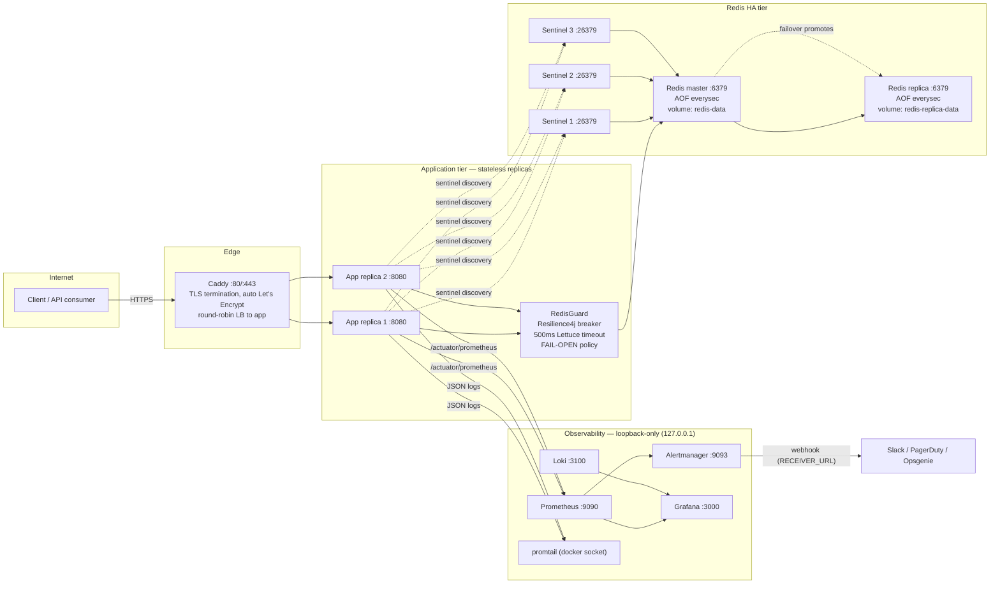
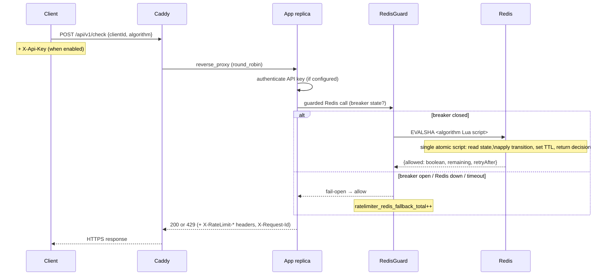
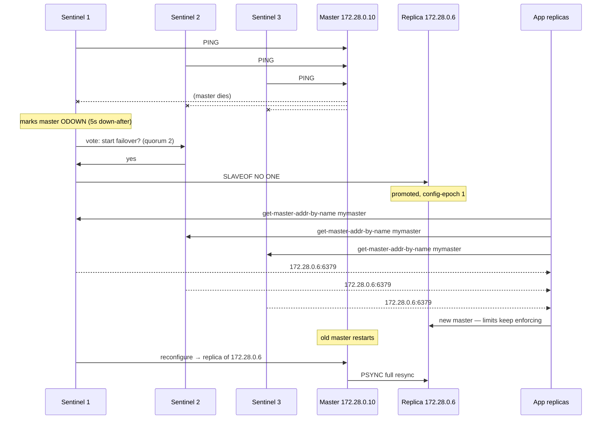
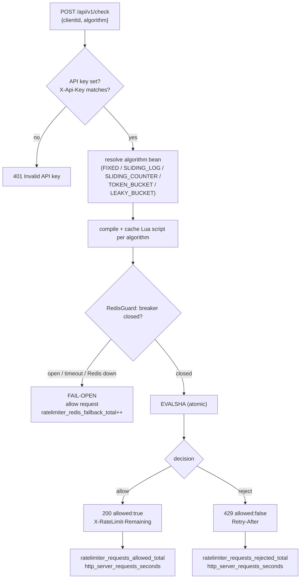
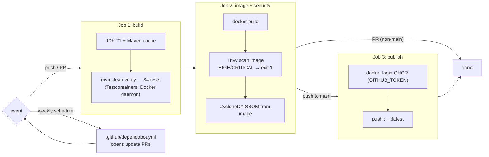

# Architecture deep-dive

Detailed diagrams for the Rate Limiter Service. The recruiter-friendly overview lives in the [README](../README.md).

## 1. System architecture

Key properties:

- **Single point of entry**: Caddy. In TLS mode the app publishes no host port — nothing reaches replicas except through the edge.
- **Stateless replicas**: all limit state lives in Redis; `--scale app=N` is the only scaling knob.
- **Loopback-only monitoring**: Prometheus, Alertmanager, Loki, Grafana bind `127.0.0.1`, so the observability stack is not LAN-exposed. Grafana requires `GRAFANA_ADMIN_USER`/`GRAFANA_ADMIN_PASSWORD` — compose fails closed without them.

## 2. Request flow

The `RedisGuard` wraps every Redis operation with a Resilience4j circuit breaker (sliding window 10, 50% failure threshold, 30 s open state, 3 half-open probes) plus the 500 ms Lettuce command timeout. Two escape hatches, both fail-open.

## 3. Redis Sentinel failover

Verified drill (`RUNBOOK.md` → failover drill):

1. `docker stop rate-sentinel-3-1` — 2/3 sentinels still form the quorum.
2. `docker stop rate-limiter-redis` — master dies with only 2 sentinels alive.
3. Failover completed; app kept serving 200/429 throughout.
4. `docker compose up -d` — old master rejoins as a replica, `master-link-status: ok`, offsets catch up.

Requirements baked into the compose files:

- Sentinels monitor the master by **static IP** (`172.28.0.10`), never a hostname — a stopped container's DNS name vanishes, which breaks monitoring.
- All three sentinels share the same entrypoint script (`monitoring/sentinel-entrypoint.sh`), quorum via `SENTINEL_QUORUM` (1 in dev, 2 with `docker-compose.sentinel-ha.yml`).
- The app learns all three sentinel nodes (`sentinel:26379,sentinel-2:26379,sentinel-3:26379`) so losing one never breaks topology discovery.
- Redis AUTH is propagated: `--requirepass` on master/replica, `--masterauth` on the replica, `sentinel auth-pass` on sentinels.

## 4. Rate limiter algorithm flow

### What each algorithm does atomically in Redis

| Algorithm | Redis data | Script steps |
|---|---|---|
| FIXED | `rl:{clientId}:fixed:{windowStart}` | INCR + EXPIRE (first call sets TTL) |
| SLIDING_LOG | sorted set `rl:{clientId}:log:{algo}` | ZREMRANGEBYSCORE (expired), ZCARD, ZADD |
| SLIDING_COUNTER | two counters + last-window timestamp | weighted estimate `prev×(1−elapsed/window)+current` |
| TOKEN_BUCKET | hash: `tokens`, `lastRefill` | compute refill since last access, consume 1 |
| LEAKY_BUCKET | hash: `water`, `lastLeak` | drain by elapsed windows, allow if `water < capacity` |

## 5. CI/CD pipeline

Why an image-based SBOM: Trivy's `fs` mode hit Maven Central rate limits during development; scanning the built image produces the same CycloneDX inventory with one source of truth.

## Data flow / ports matrix

| Port | Service | Bind | Purpose |
|---|---|---|---|
| 80 / 443 | Caddy | host | HTTPS edge (TLS mode) |
| 8080 | app | **none in TLS mode** / 8080 in dev | `/api/v1/check`, actuator |
| 6379 | Redis master + replica | internal | data |
| 26379 | Sentinels ×3 | internal | monitoring + discovery |
| 9090 | Prometheus | 127.0.0.1 | queries, alerts, targets |
| 9093 | Alertmanager | 127.0.0.1 | routing to webhook |
| 3000 | Grafana | 127.0.0.1 | dashboards |
| 3100 | Loki | 127.0.0.1 | log storage + query API |

## Resilience summary

| Failure | Behavior | Metric / alert |
|---|---|---|
| Redis master down | Sentinel failover ~15 s; app keeps serving (fail-open during the gap) | `RedisCircuitBreakerOpen` / `RedisFailingOpen` |
| All of Redis down | Fail-open: traffic allowed, breaker open, alerts fire | `ratelimiter_redis_fallback_total` |
| One sentinel down | 2/3 quorum still elects | none (topology degrades gracefully) |
| One app replica down | Caddy fails over to the survivor | `RateLimiterDown` per-target |
| Sustained abuse | Per-client 429s, `HighThrottleRate` if >50% | `HighThrottleRate` |
